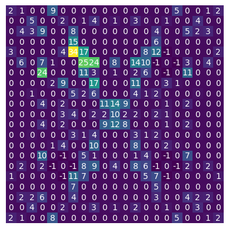

# About
Rules based bot for Halite IV simulation competition.
Final leader board position - 27th

https://www.kaggle.com/c/halite/overview

# Code Structure
### Scripts
`new_version.sh`
Takes a version name as an argument.
Copy bot in agent/main.py to submission.py and bots/{version_name}.py

Prepends changelog.txt to the start.

`example.py`
Run bot locally for debugging.

`replay.py`
Replay .jsons from leaderboard games.

`agent_template.py`
Template for stateful bot using globals.

### Directories
`agent` Active bot

`bots` Submitted bot versions

`analysis` Scratch scripts

`utils` Utility functions

`html` Store HTML replays to view in browser

# Bot Strategy
Strategy has 3 main behaviours:
##### Early game - Turn 0 -> 80
- Spawn ships and harvest.
- Maintain N shipyards, function of number of ships.
##### Mid game - Turn 80 -> 250
- Keep majority of ships at zero halite (suppressors), depending on how many halite spots are considering worth harvesting.
- Suppressors chase and try to win collisions with enemy ships near allied shipyards.
- Spawn more ships if I'm in lead of the second best opponent or have less ships than them.
##### End game - Turn 250 -> 400
- Gradually move all ships back to harvesting.
- Maintain 5 ships and 1 shipyard (if it's worth it)

### Ship action assignment loop
Ships are grouped by the number of adjacent enemy and ally ships to them. In order of most adjacent
ships, every ship in a group determines its best potential move and associated position for the next step.
Moves to that position are then confirmed for this turn if there is only 1 ship attempting to move there, otherwise one ship
is assigned based on its priority. Any ships that were not assigned a spot will re-evaluate, knowing which positions are now reserved.

Once each ship in a group has a set action, the next group is considered until all ships have a set action.

### Harvest/deposit logic
Each harvestor reserves a halite spot based on some value weight estimating the return from harvesting it:



Spots adjacent enemy shipyards are weighted as -1. Each turn ships re-evaluate the spot based on more local information.

If a spot is considered locally overharvested, it will move to some spot nearby.
If it reaches a cargo limit (or is frustrated by other threats), it will change roles to deposit, trying to opportunistically harvest while moving back to the
nearest shipyard.

```
# Is cell two harvests below the local mean?
target_cell.halite < target_cell.halite_local_mean * 0.75 ** 2
OR
# Is cell close and occupied by a threat?
(
    distance(spot, target_cell.position) <= 2
    AND self.is_pos_occupied_by_threat(ship, target_cell.position
)
```

### Movement
Ships will try to move closer to their assigned target. Each ship role has a priority list of conditions it requires 
to consider a move safe. If no safe move is available, these conditions are iteratively removed based on their priority until an acceptable move is found.

### Shipyard converting
Maintain some number of ship yards depending on the number of active allied ships. If the current number of shipyards is below
the maximum then try to find a ship for conversion. Shipyards are required to be at least a distance of 6 from all other
allied yards but within 8 of the nearest one, plus some other conditions. If these are not met for any ship, then no conversion action is given.

### Shipyard defending
If an enemy ship is within some radius of a shipyard, the nearest allied ship is assigned to defend it. This involves
sitting on the yard until we want to spawn a new ship, or allow a depositor to move onto the yard. Critically, we don't move
a depositor onto a yard if a threat can also move onto the yard, since this would potentially lose a ship and yard for one enemy ship.

### Squadron suppressing
Ships of the suppressor role are grouped together in squadrons, at most 4 to a squadron. Each squad is assigned a single
non-zero halite target ship to chase until it gets close to its own shipyard or is far from an allied yard. Targets are re-evaluated
each turn, where enemy ships are scored on their distance to both the nearest allied shipyard to them and the midpoint of the squad itself.

The main job of squadrons is to harass and maintain board control, but squadrons will also try to opportunistically flank
the same enemy ship if it is close and in the middle of two squads.